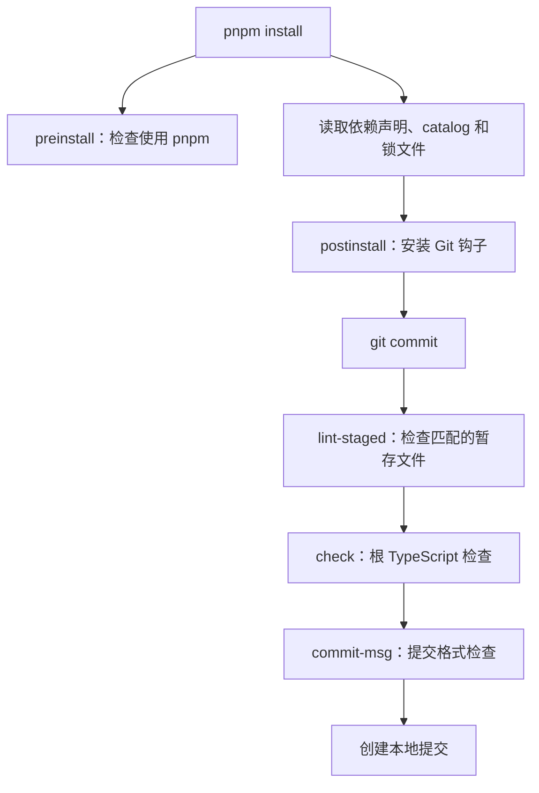

# 根目录 package.json 字段与脚本说明

这份文档逐项解释根目录 `package.json` 的用途，覆盖 **9 个顶层字段、40 条 scripts 和 52 项 devDependencies**，并结合实际脚本说明运行效果。

阅读基准：`D:/ProjectCode/vue3/package.json`；分支 `lmy`；提交 `9b1abd46459bf8a83111990d062c506abd9ab834`；整理日期 2026-09-02。以下说明来自配置与源码核对，本次未运行构建、清理、发布或 Git 提交命令。

## 1. 这个根配置负责什么

根目录是 Vue 多包仓库的工具入口。这里集中安装开发工具、定义命令和提交检查；实际的 Vue 运行时、编译器等包位于各子工程中。

根配置当前没有 `name`、`main`、`exports` 或 `dependencies`。这与它作为私有工具根包的定位一致；需要了解用户安装 Vue 后的入口和依赖，应查看 `D:/ProjectCode/vue3/packages/vue/package.json`。

工作区成员不在根 package.json 中声明，而在 `D:/ProjectCode/vue3/pnpm-workspace.yaml` 中配置为 `packages/*` 和 `packages-private/*`。

## 2. 顶层字段逐项说明

| 字段 | 当前值 | 用途 |
| --- | --- | --- |
| `private` | `true` | 禁止把仓库根包作为普通 npm 包发布。Vue 各子包的发布由子包配置和发布脚本处理；该值不影响 Git 推送，也不表示源码保密。 |
| `version` | `3.5.39` | 仓库根版本号。release.js 读取它作为当前版本，并在发布流程中更新根目录及相关子包版本。 |
| `packageManager` | `pnpm@11.9.0` | 声明项目期望使用的包管理器及其版本。支持该字段的工具据此选择或校验 pnpm；这是工具链版本，不是 Vue 版本。 |
| `type` | `module` | 使该包作用域内的 .js 文件按 ES Module 解释，所以根脚本可以使用 import/export。嵌套 package.json 会形成自己的包作用域；该字段不负责指定构建产物格式。 |
| `scripts` | `40 条命令` | 集中定义安装、开发、构建、测试、格式化和发布入口；每个键是脚本名，值是实际命令。 |
| `simple-git-hooks` | `2 个 Git 钩子` | 第三方工具 simple-git-hooks 读取的配置，定义提交前检查和提交消息检查。仅写入 JSON 不会自动安装钩子，postinstall 执行安装。 |
| `lint-staged` | `2 组文件匹配规则` | 第三方工具 lint-staged 读取的配置，按已暂存文件的扩展名选择修复和格式化任务。 |
| `engines.node` | `>=20.0.0` | 声明根项目的 Node.js 版本范围。它不是实际安装的 Node 版本，也不能保证每个工具依赖都兼容所有 Node 20 小版本；还需满足工具本身的要求。 |
| `devDependencies` | `52 项依赖` | 记录根工程所需的构建、测试、规范检查和示例工具。它们服务于源码仓库开发；Vue 子包对外提供的依赖由各自 package.json 声明。 |

字段的一般语义参见 [npm package.json 文档](https://docs.npmjs.com/cli/v11/configuring-npm/package-json/)；本表中的项目行为以本仓库脚本为依据。项目另有 `.node-version`，内容为 `lts/*`，它与 `engines.node` 分别承担运行环境选择和版本范围声明的职责。

## 3. 如何阅读 scripts

可以用 `pnpm run 脚本名` 执行。例如：

```bash
pnpm run dev reactivity
pnpm run build runtime-dom -f esm-bundler
pnpm run check
pnpm run test-unit --run
pnpm run test-dts
pnpm run dev-sfc
```

脚本运行时可以找到本地安装的命令，例如 `tsc`、`eslint`、`vitest`，通常无需全局安装这些工具。需要减少与 pnpm 自带命令的歧义时，使用完整的 `pnpm run ...` 写法。[pnpm run 文档](https://pnpm.io/cli/run)

### 命令组合与参数

- `&&`：前一个命令成功后才执行后一个。
- `||`：前一个命令失败时执行后一个，本仓库用它在检查不到构建产物时补做构建。
- `run-s`：串行执行多个脚本；`run-p`：并行执行多个脚本。两者由 `npm-run-all2` 提供。
- `-f`：指定构建格式；`-p`：生产构建；`-i`：在 dev.js 中内联依赖；`-d`：在 build.js 中只构建开发版本；`-a`：在 build.js 中构建所有匹配目标。
- 合并的短选项可以拆开理解，例如 `-ipf esm-browser-runtime` 表示 `-i -p -f esm-browser-runtime`。参数含义以接收它的脚本为准。

格式名称也有区别：`global` 面向浏览器脚本引入；`cjs` 为 CommonJS；`esm-bundler` 面向打包工具；`esm-browser` 面向浏览器 ESM。Vue 格式名中的 `runtime` 表示仅运行时版本，不包含完整模板编译能力。

### 开发与调试

| 脚本 | 用途与执行效果 |
| --- | --- |
| `dev` | 用 esbuild 持续构建源码，默认目标为 vue、格式为 global；这是包的监听构建，不会自动启动示例网站。可传入包名。 |
| `dev-esm` | 监听构建 Vue 的 esm-bundler-runtime 产物，并使用 -i 将依赖内联，便于本地 ESM 调试。 |
| `dev-compiler` | 并行启动 template-explorer 的监听构建和静态文件服务，用于查看模板编译输出。 |
| `dev-sfc` | 串行执行 dev-sfc-prepare 与 dev-sfc-run，启动完整 SFC Playground 开发流程。 |
| `dev-sfc-prepare` | 检查 Playground 需要的编译器 CJS 产物；检查失败时执行 build-all-cjs。这里只检查目标文件是否存在，不判断它们是否与最新源码一致。 |
| `dev-sfc-serve` | 为 packages-private/sfc-playground 启动 Vite 服务；--host 使服务可监听非仅本机回环地址。 |
| `dev-sfc-run` | 并行监听构建 compiler-sfc、Vue 的开发/生产运行时和 server-renderer，并启动 Playground 的 Vite 服务。 |
| `serve` | 执行 serve 静态服务器，用于访问仓库内示例和本地调试页面；它不负责编译 Vue 源码。 |
| `open` | 意图打开本地 Template Explorer 的固定地址 [http://localhost:3000/packages-private/template-explorer/local.html；需要服务已经启动且](http://localhost:3000/packages-private/template-explorer/local.html；需要服务已经启动且) open 命令可用。 |

### 构建与体积

| 脚本 | 用途与执行效果 |
| --- | --- |
| `build` | 调用 Rollup 构建目标包；可指定包名和格式。未传目标时构建通用目标集合并跳过 private 包；默认不等于同时生成所有类型声明。 |
| `build-dts` | 先用 TypeScript 按 [tsconfig.build](http://tsconfig.build).json 输出声明，再用 rollup.dts.config.js 汇总各核心包的 .d.ts；--noCheck 表示此阶段跳过完整类型检查。 |
| `clean` | 删除 packages/*/dist、temp 和 .eslintcache，清理构建产物及指定缓存；没有列出 node_modules 或 packages-private/*/dist。 |
| `size` | 串行执行 size-* 子脚本，再运行 usage-size.js，比较完整包及不同 API 使用组合的压缩体积。 |
| `size-global` | 构建 vue、runtime-dom 的生产 global 格式并记录体积数据；-p 为仅生产构建，--size 用于写入体积结果。 |
| `size-esm-runtime` | 构建 Vue 的 esm-bundler-runtime 版本，为运行时使用场景的体积分析准备产物。 |
| `size-esm` | 构建 runtime-dom、runtime-core、reactivity、shared 的 esm-bundler 产物，为体积分析准备依赖。 |

### 检查与测试

| 脚本 | 用途与执行效果 |
| --- | --- |
| `check` | 执行增量 TypeScript 检查，不输出 JS；检查范围由根 tsconfig.json 决定，不代表 packages-private 下全部类型用例已执行。 |
| `lint` | 按 ESLint 配置检查代码并使用缓存；该命令没有 --fix，不会主动执行自动修复。 |
| `format` | 使用 Prettier 格式化并写回文件，启用缓存。 |
| `format-check` | 检查格式是否符合 Prettier 规则并启用缓存，不写回文件。 |
| `test` | 启动 Vitest，项目范围由 vitest.config.ts 决定。本地通常进入监听模式；需要单次执行时使用 pnpm run test --run。 |
| `test-unit` | 筛选 unit* 项目；当前包含 unit、unit-gc 和 unit-jsdom，不包含两个 e2e 项目。 |
| `test-e2e` | 先构建 Vue 的开发版 global 产物，再运行 e2e 与 e2e-browser；后者使用 Playwright Chromium，测试可能需要浏览器环境。 |
| `test-dts` | 先执行 build-dts，再执行 test-dts-only，完成声明构建和类型回归检查。 |
| `test-dts-only` | 先编译 dts-built-test 声明样例，再检查 dts-test；依赖事先生成且与源码一致的 Vue 声明文件。 |
| `test-coverage` | 单次执行 unit* 项目并收集覆盖率；具体统计范围和排除项由 Vitest 配置控制。 |

### 基准与发布

| 脚本 | 用途与执行效果 |
| --- | --- |
| `prebench` | bench 的前置准备：构建 reactivity 的生产版 esm-browser 产物。 |
| `prebench-compare` | bench-compare 的前置准备，与 prebench 使用同一构建命令。 |
| `bench` | 运行 unit 项目中的基准测试，并将结果输出到 temp/bench.json，作为后续比较基线。 |
| `bench-compare` | 运行基准测试，并与 temp/bench.json 比较；需要先存在可用的基线文件。 |
| `release` | 调用发布流程：选择版本、按条件检查、更新包版本和日志、更新锁文件，并按参数执行 Git 提交、打标签和推送。--publish 才进入本地构建并向 registry 发布的分支；默认 publish 为 false。 |
| `changelog` | 用 conventional-changelog 的 angular 预设读取提交历史，将生成的更新内容写回 [CHANGELOG.md](http://CHANGELOG.md)；-i 指定原文件，-s 表示同文件写回。 |

### Playground 构建

| 脚本 | 用途与执行效果 |
| --- | --- |
| `build-sfc-playground` | 依次准备 CJS、运行时 ESM、完整浏览器 ESM、SSR ESM 产物，最后构建 Playground 网站。 |
| `build-all-cjs` | 以 -a 匹配 vue、runtime、compiler、reactivity、shared 对应包，输出 CJS 产物；这些参数是包名匹配条件。 |
| `build-runtime-esm` | 先构建 runtime/reactivity/shared 的 esm-bundler，再构建 Vue 的 esm-bundler-runtime 与 esm-browser-runtime。 |
| `build-browser-esm` | 先构建 runtime/reactivity/shared 的 esm-bundler，再构建包含编译能力的 Vue esm-bundler 和 esm-browser。 |
| `build-ssr-esm` | 构建 compiler-sfc 与 server-renderer 的 esm-browser 产物，供 Playground 等环境使用。 |
| `build-sfc-playground-self` | 切换到 sfc-playground 子工程执行其 build 脚本，也就是 Vite 网站构建；自身不补齐前述 Vue 产物。 |

### 安装生命周期

| 脚本 | 用途与执行效果 |
| --- | --- |
| `preinstall` | 安装前执行 npx only-allow pnpm，检查本次安装是否使用 pnpm。npx 执行工具与“使用 npm 安装项目依赖”是两回事；only-allow 未作为根开发依赖固定。 |
| `postinstall` | 安装后调用 simple-git-hooks，将本文件中的 Git 钩子配置安装到仓库。 |

### 三组需要分清的流程

**开发与构建：** `dev` 持续监听源码变化，`build` 执行一次目标构建。它们构建的是 Vue 包；Playground 网站还需要自己的服务或网站构建步骤。

**构建与校验：** `build-dts` 生成声明文件，但明确带有 `--noCheck`。声明文件生成成功不代表类型正确。完整类型回归入口是 `test-dts`，它先生成声明，再执行测试工程的 TypeScript 检查。

**提交检查与完整测试：** `check` 遵循根 tsconfig 的范围，Git 提交钩子没有执行 Vitest 全套测试，也没有执行 `test-dts`。当前根 tsconfig 未直接纳入 `packages-private` 的全部类型用例，因此提交成功不能替代完整类型测试。

### 生命周期和平台细节

`prebench`、`prebench-compare` 是对应脚本的前置任务。pnpm 的 `enablePrePostScripts` 控制自动执行前后置脚本，当前官方默认值为 true；如果运行环境修改了这一设置，执行方式会变化。[pnpm 前后置脚本设置](https://pnpm.io/cli/run#enableprepostscripts)

`open` 脚本直接调用外部 `open` 命令，根依赖没有提供对应命令；本次在当前 Windows 环境中也没有找到它。如果该脚本提示命令不存在，可在静态服务启动后直接用浏览器访问 [本地 Template Explorer](http://localhost:3000/packages-private/template-explorer/local.html)，或在 PowerShell 使用：

```powershell
Start-Process 'http://localhost:3000/packages-private/template-explorer/local.html'
```

`release` 会改变版本、日志和 Git 状态，默认流程还会推送标签及分支。当前源码里 `publish` 默认 false，只有显式开启后才在本地构建并向 registry 发布；因此不能简单把它描述成“只生成发布文件”或“每次都直接 npm publish”。本次只是阅读该脚本。

## 4. simple-git-hooks：提交时会发生什么

当前配置：

```json
{
  "pre-commit": "pnpm lint-staged && pnpm check",
  "commit-msg": "node scripts/verify-commit.js"
}
```

- `pre-commit`：先运行 `pnpm lint-staged`，成功后运行 `pnpm check`。前者可能修改并重新暂存文件，后者检查根 TypeScript 工程；失败会阻止本次提交。
- `commit-msg`：执行 `scripts/verify-commit.js`，读取 Git 提交消息并校验约定格式，例如 `docs: explain root package configuration`、`fix(runtime-dom): correct event handling`。
- 检查器允许的类型包括 `feat`、`fix`、`docs`、`dx`、`style`、`refactor`、`perf`、`test`、`workflow`、`build`、`ci`、`chore`、`types`、`wip`、`release`，可以带括号中的范围。
- 当前正则虽然写有 `.{1,50}`，但没有结尾锚点，不能据此声称它严格限制整条提交消息最多 50 个字符。

`postinstall` 负责安装钩子；配置对象本身只是提供规则。Git 钩子不会自动执行 push。

## 5. lint-staged：只对匹配的暂存文件执行任务

| 匹配规则 | 顺序执行的任务 | 含义 |
| --- | --- | --- |
| `*.{js,json}` | `prettier --write` | 对暂存的 .js、.json 文件统一格式。 |
| `*.ts?(x)` | `eslint --fix` → `prettier --parser=typescript --write` | 匹配 .ts、.tsx；先修复可自动处理的 ESLint 问题，再按 TypeScript 语法格式化。 |

数组中的任务有先后顺序，文件路径由 lint-staged 传给命令。这里没有 Markdown、YAML 或 Vue 文件的匹配项，所以仅提交这些文件时，这两组任务可能都不运行；后续的 `pnpm check` 仍然会执行。

这与根 `format` 脚本不同：`format` 面向当前目录中 Prettier 支持且未忽略的文件，`lint-staged` 面向符合规则的暂存文件。

## 6. devDependencies：52 项依赖的用途

每个键是包名，值是声明的版本范围或目录引用。下表保留当前文件中的版本写法；它们不等于本机已经安装的精确版本，安装解析还需结合锁文件。

### 编译与构建

| 依赖 | 声明版本 | 用途 |
| --- | --- | --- |
| `@babel/parser` | `catalog:` | 将 JavaScript/TypeScript 等语法解析为 AST，供编译器和构建脚本分析使用。 |
| `@babel/types` | `catalog:` | 提供 Babel AST 节点类型和辅助定义，支持编译器处理语法树。 |
| `@rollup/plugin-alias` | `^6.0.0` | 为 Rollup 配置模块路径别名。 |
| `@rollup/plugin-commonjs` | `^29.0.3` | 让 Rollup 处理 CommonJS 模块。 |
| `@rollup/plugin-json` | `^6.1.0` | 让 Rollup 导入 JSON 模块。 |
| `@rollup/plugin-node-resolve` | `^16.0.3` | 让 Rollup 解析包名导入与 node_modules 中的依赖入口。 |
| `@rollup/plugin-replace` | `5.0.4` | 在构建时替换版本、环境和功能标记等常量，配合后续优化。 |
| `@swc/core` | `^1.15.43` | 本仓库的 Rollup 配置及体积脚本使用其 minify 能力压缩 JavaScript。 |
| `@vue/consolidate` | `1.0.0` | 统一调用模板预处理器，供 SFC 模板编译流程使用。 |
| `esbuild` | `^0.28.1` | 支撑开发模式的快速转译、打包和监听重建。 |
| `esbuild-plugin-polyfill-node` | `^0.3.0` | 在特定 esbuild 浏览器构建中提供 Node 模块兼容实现；由构建条件控制。 |
| `estree-walker` | `catalog:` | 遍历 ESTree 风格的 AST，供编译转换使用。 |
| `magic-string` | `^0.30.21` | 按位置编辑源码字符串并支持源映射，供编译器和声明处理脚本使用。 |
| `rollup` | `^4.62.2` | 正式构建的打包器，支持模块优化与多种产物格式。 |
| `rollup-plugin-dts` | `^6.4.1` | 汇总、打包 TypeScript 声明文件。 |
| `rollup-plugin-esbuild` | `^6.2.1` | 在 Rollup 流程中接入 esbuild 转译。 |
| `rollup-plugin-polyfill-node` | `^0.13.0` | 为特定 Rollup 浏览器构建提供 Node 模块兼容实现。 |

### 类型支持

| 依赖 | 声明版本 | 用途 |
| --- | --- | --- |
| `@types/hash-sum` | `^1.0.2` | 为 hash-sum 提供 TypeScript 类型声明。 |
| `@types/node` | `^24.13.2` | 提供 Node.js API 的 TypeScript 声明；其版本不等于实际运行的 Node.js 版本。 |
| `@types/semver` | `^7.7.1` | 为 semver 提供 TypeScript 类型声明。 |
| `@types/serve-handler` | `^6.1.4` | 为 serve-handler 提供 TypeScript 类型声明。 |
| `tslib` | `^2.8.1` | TypeScript 辅助函数运行库；存在于开发依赖列表不表示每个 Vue 产物都会引入它。 |
| `typescript` | `~5.6.2` | 提供 tsc，用于类型检查和声明文件生成。 |

### 测试与规范

| 依赖 | 声明版本 | 用途 |
| --- | --- | --- |
| `@vitest/browser-playwright` | `4.1.9` | 把 Playwright 浏览器接入 Vitest Browser Mode。 |
| `@vitest/coverage-v8` | `^4.1.9` | 为 Vitest 提供基于 V8 的覆盖率采集。 |
| `@vitest/eslint-plugin` | `^1.6.20` | 在 ESLint 中检查 Vitest 测试代码的使用规则。 |
| `eslint` | `^10.5.0` | 代码规范与静态规则检查器。 |
| `eslint-plugin-import-x` | `^4.17.0` | 扩展导入、模块引用相关的 ESLint 规则。 |
| `jsdom` | `^29.1.1` | 在 Node.js 中提供 DOM 模拟环境，供对应测试项目使用。 |
| `lint-staged` | `^17.0.8` | 筛选 Git 暂存文件并运行本文件配置的格式化、修复任务。 |
| `playwright` | `^1.61.1` | 真实浏览器自动化，供浏览器测试及相关工具使用。 |
| `prettier` | `^3.8.4` | 统一源码及配置文件的格式。 |
| `pug` | `^3.0.4` | Pug 模板引擎，支持 SFC 模板预处理场景及相关测试。 |
| `puppeteer` | `~25.2.0` | 浏览器自动化工具，供端到端测试使用。 |
| `simple-git-hooks` | `^2.13.1` | 把 package.json 中的配置写成 Git 钩子。 |
| `typescript-eslint` | `^8.62.0` | 让 ESLint 理解 TypeScript 语法并使用相关规则。 |
| `vitest` | `^4.1.9` | 测试运行器，承载单元、浏览器相关测试、基准和覆盖率流程。 |

### 工程工具与示例

| 依赖 | 声明版本 | 用途 |
| --- | --- | --- |
| `conventional-changelog` | `^7.2.1` | 提供从 Git 提交生成变更日志的命令。 |
| `conventional-changelog-angular` | `^8.3.1` | 为变更日志生成器提供 angular 提交格式预设。 |
| `enquirer` | `^2.4.1` | 为发布脚本提供终端选择、输入和确认交互。 |
| `lodash` | `^4.18.1` | 通用工具函数库；仓库的部分 HTML 示例使用它。 |
| `markdown-table` | `^3.0.4` | 体积报告脚本使用它生成 Markdown 表格。 |
| `marked` | `13.0.3` | Markdown 解析器，供仓库中的 Markdown 编辑器示例使用。 |
| `npm-run-all2` | `^9.0.2` | 提供 run-s、run-p 命令，组合串行和并行脚本任务。 |
| `picocolors` | `^1.1.1` | 为构建、发布、提交检查等终端输出添加颜色。 |
| `pretty-bytes` | `^7.1.0` | 将字节数格式化为易读体积，供构建和体积报告显示。 |
| `rimraf` | `^6.1.3` | 跨平台删除文件和目录，供 clean 脚本使用。 |
| `semver` | `^7.8.5` | 发布脚本用于解析、比较和递增语义化版本。 |
| `serve` | `^14.2.6` | 静态文件服务器命令行工具。 |
| `serve-handler` | `^6.1.7` | 程序化静态文件请求处理器，测试代码可将其接入 HTTP 服务器。 |
| `todomvc-app-css` | `^2.4.3` | 为 TodoMVC 示例提供样式。 |
| `vite` | `catalog:` | 为 SFC Playground、Vite Debug 等工程提供开发服务与网站构建工具。 |

### 版本写法怎么读

| 写法 | 本文件中的例子 | 含义 |
| --- | --- | --- |
| 精确版本 | `5.0.4`、`4.1.9` | 只接受指定的版本。 |
| 插入符范围 | `^6.0.0` | 对这个主版本大于零的例子，范围为 >=6.0.0 且 <7.0.0。 |
| 零主版本范围 | `^0.28.1` | 范围为 >=0.28.1 且 <0.29.0，不能套用“大版本不变都允许”的简化说法。 |
| 波浪线范围 | `~5.6.2`、`~25.2.0` | 这两个例子分别允许 5.6.x、25.2.x 中不低于指定版本的补丁更新。 |
| 共享目录引用 | `catalog:` | 从 pnpm-workspace.yaml 的默认 catalog 读取该依赖的版本范围。 |

本文件中四项 `catalog:` 的实际配置为：

| 依赖 | 默认 catalog 中的范围 |
| --- | --- |
| `@babel/parser` | `^7.29.7` |
| `@babel/types` | `^7.29.7` |
| `estree-walker` | `^2.0.2` |
| `vite` | `^8.1.0` |

`catalog:` 的目的是让多个 workspace 包共享版本配置；这里的目录引用最终仍然展开成版本范围。精确依赖解析记录在 `pnpm-lock.yaml` 中。[pnpm Catalogs 文档](https://pnpm.io/catalogs)

## 7. 从安装到提交的关联关系



该图展示用途关联，安装步骤的具体调度由包管理器控制。Vitest 测试、`test-dts`、构建和发布都是独立脚本，未被这条提交检查流程自动覆盖。

## 8. 常见任务对应入口

| 我想做什么 | 使用哪个入口 |
| --- | --- |
| 修改响应式源码并持续生成本地产物 | `pnpm run dev reactivity` |
| 执行一次单元测试 | `pnpm run test-unit --run` |
| 确认类型声明兼容性 | `pnpm run test-dts` |
| 检查格式，但不修改文件 | `pnpm run format-check` |
| 自动统一文件格式 | `pnpm run format` |
| 调试完整 .vue 示例 | `pnpm run dev-sfc` |
| 观察模板编译结果 | `pnpm run dev-compiler`，再打开本地 Template Explorer |
| 清理指定构建产物和缓存 | `pnpm run clean` |

## 查证依据与相关文档

本次以本地代码为主，官方文档用于核对包管理字段和脚本规则。主要读取：

- `D:/ProjectCode/vue3/package.json`、`D:/ProjectCode/vue3/pnpm-workspace.yaml`、`D:/ProjectCode/vue3/.node-version`。
- `D:/ProjectCode/vue3/scripts/dev.js`、`D:/ProjectCode/vue3/scripts/build.js`、`D:/ProjectCode/vue3/scripts/usage-size.js`、`D:/ProjectCode/vue3/scripts/release.js`、`D:/ProjectCode/vue3/scripts/verify-commit.js`。
- `D:/ProjectCode/vue3/tsconfig.json`、`D:/ProjectCode/vue3/tsconfig.build.json`、`D:/ProjectCode/vue3/rollup.config.js`、`D:/ProjectCode/vue3/rollup.dts.config.js`、`D:/ProjectCode/vue3/vitest.config.ts`、`D:/ProjectCode/vue3/eslint.config.js`。
- 编译器、测试和示例中的依赖引用，以及本地 `tslib` 说明。

进一步了解私有工具工程：[packages-private 目录用途说明](<packages-private-目录用途说明.md>)。

[文档整理](../%E6%96%87%E6%A1%A3%E6%95%B4%E7%90%86.md)