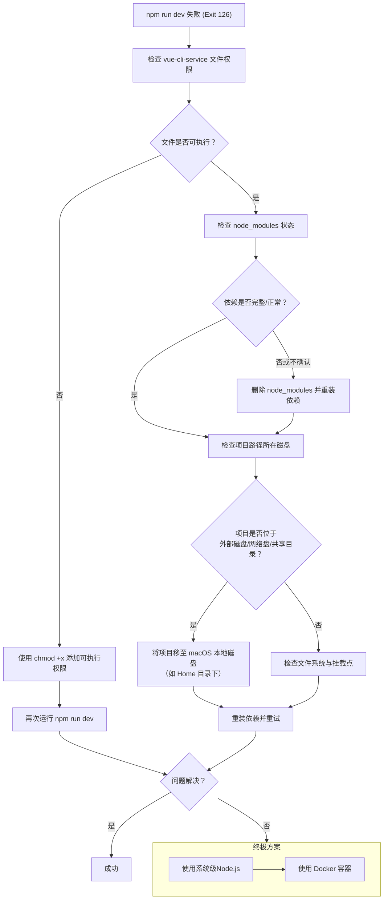

# 报错处理

## 1.npm run dev失败

**报错日志:**


[2025-12-07T07_51_36_241Z-debug.log](%E6%8A%A5%E9%94%99%E5%A4%84%E7%90%86/2025-12-07T07_51_36_241Z-debug.log)

**原因:**根据日志分析，这个 **`Exit status 126`** 错误的核心原因是：**系统试图执行 `vue-cli-service` 命令，但该文件不具备可执行权限，或者其所在的文件系统存在挂载/权限问题。**

**解决:**

```bash
# 1. 进入项目根目录cd /Users/lm/Documents/DianWang/Code/ZhiBiaoKu/metric-library-web

# 2. 检查 vue-cli-service 的权限ls -l node_modules/.bin/vue-cli-service

# 3. 如果输出中没有 `x`（如 -rw-r--r--），则需要添加可执行权限chmod +x node_modules/.bin/vue-cli-service

# 4. 同时，也建议确保所有依赖的脚本都有权限chmod +x node_modules/.bin/*
```



## 2.下载文件名从xxx.xlsx变成 `xxx.xlsx_`（末尾多下划线)

原因:

### 【最常见】后端返回的 `Content-Disposition` 响应头中，文件名被**双引号包裹**

`Content-Disposition: attachment; filename="导出数据.xlsx"`

而非干净的格式：

`Content-Disposition: attachment; filename=导出数据.xlsx`

【次要】文件名中包含「不可见的空白字符 / 特殊字符」

解决:

1.返回干净格式

2.修改解析代码

```jsx
// 万能正则，直接提取 文件名.xlsx 核心内容，无视双引号/空格/编码格式
const fileNameMatch = contentDisposition.match(/filename[^;=\n]*=((['"])(.*?)\2|([^;\n]*))/);
fileName = fileNameMatch ? decodeURIComponent(fileNameMatch[3] || fileNameMatch[4]) : '导出文件.xlsx';
```

原理:浏览器在解析下载文件名时，**不允许文件名中包含双引号这种非法字符**，会自动把非法字符替换成 `下划线_`，最终文件名就变成了 `导出数据.xlsx_`